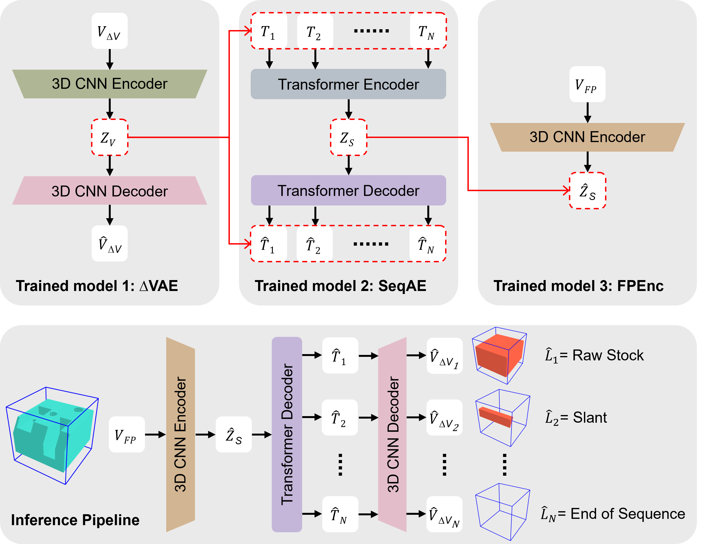

# DeepMS

This repository provides source code for our paper [**DeepMS: A Data-Driven Approach to Machining Process Sequencing Using Transformers**](https://doi.org/10.1016/j.jmsy.2025.07.022) published in Journal of Manufacturing Systems, 2025.

*Jaime Maqueda, et al.*

<p align="center">
  
</p>

DeepMS is a deep learning framework for automatically determining optimal machining process sequences. Using transformer architectures, the system predicts an efficient operation order from a voxelized representation of the final part, handling complex geometric features and manufacturing constraints.

The dataset generation code for this project can be found in the [DeepMS-DataGen repository](https://github.com/jaimemaqueda/DeepMS-DataGen).

## Architecture

DeepMS consists of three main components:

1. **Voxel Autoencoder (VoxAE)**: Provides volumetric representations of intermediate machining steps.
2. **Sequence Autoencoder (SeqAE)**: Uses transformers to model and predict machining operation sequences.
3. **Part Encoder (PartE)**: Encodes voxelized representations of 3D parts into latent embeddings.

## Prerequisites

- Linux or Windows
- NVIDIA GPU + CUDA CuDNN
- Python 3.7+

## Installation

We recommend creating a conda environment:

```bash
# Clone the repository
git clone https://github.com/jaimemaqueda/DeepMS.git
cd DeepMS

# Create conda environment
conda env create -f environment.yml

# Activate environment
conda activate deepms_env
```

## Dataset

The dataset is generated using the companion [DeepMS-DataGen tool](https://github.com/jaimemaqueda/DeepMS-DataGen). The datasets should be organized in the following structure:

```
data/
├── seq_h5/        # HDF5 files containing voxelized part representations
└── seq_stl/       # STL files representing part geometries
```

The dataset contains:
- Voxelized 3D parts (128³)
- Operation sequences (RS, Mill, Drill, Slant)
- Delta volumes between operations

## Usage

### Training and Processing Pipeline

The DeepMS framework requires a specific training and processing sequence due to component dependencies:

#### 1. Train Voxel Autoencoder (VoxAE)

First, train the voxel autoencoder which learns to encode and decode 3D voxel representations:

```bash
python train_VoxAE.py --exp_name train_vox_1 --data_root path/to/data --batch_size 40 -g 0
```

Key parameters:
- `--exp_name`: Name of the experiment (defaults to directory name)
- `--data_root`: Path to the dataset directory
- `--batch_size`: Batch size for training (default: 40)
- `--nr_epochs`: Number of training epochs (default: 3)
- `--lr`: Learning rate (default: 6e-5)
- `-g`: GPU ID(s) to use

#### 2. Test Voxel Autoencoder to Update Dataset

After training VoxAE, run the testing script to reconstruct the dataset for the next stage:

```bash
python test_VoxAE.py --exp_name train_vox_1 --ckpt latest -m rec -g 0
```

This step encodes the intermediate machining steps into latent representations needed for sequence training.

#### 3. Train Sequence Autoencoder (SeqAE)

With the reconstructed dataset from VoxAE, train the sequence autoencoder:

```bash
python train_SeqAE.py --exp_name train_seq_1 --path_vox_ae_cfg train_log/train_vox_1/config.txt -g 0
```

Key parameters:
- `--path_vox_ae_cfg`: Path to the VoxAE configuration
- `--batch_size`: Batch size for training (default: 512)
- `--nr_epochs`: Number of training epochs (default: 200)
- `--lr`: Learning rate (default: 1e-3)

#### 4. Test Sequence Autoencoder to Update Dataset

After training SeqAE, run the testing script to reconstruct the sequence dataset:

```bash
python test_SeqAE.py --exp_name train_seq_1 --ckpt latest -m rec -g 0
```

This step prepares the data for the final Part Encoder training.

#### 5. Train Part Encoder (PartE)

Finally, train the part encoder which directly maps final parts to operation sequences:

```bash
python train_PartE.py --exp_name train_fpenc_1 --path_vox_ae_cfg train_log/train_vox_1/config.txt --path_seq_ae_cfg train_log/train_seq_1/config.txt -g 0
```

Key parameters:
- `--path_vox_ae_cfg`: Path to the VoxAE configuration
- `--path_seq_ae_cfg`: Path to the SeqAE configuration
- `--batch_size`: Batch size for training (default: 40)
- `--nr_epochs`: Number of training epochs (default: 10)
- `--lr`: Learning rate (default: 1e-3)

### Testing Final Models

Once the complete pipeline is trained, you can evaluate each component:

#### Test Voxel Autoencoder

```bash
python test_VoxAE.py --exp_name train_vox_1 --ckpt latest -m rec -g 0
```

#### Test Sequence Autoencoder

```bash
python test_SeqAE.py --exp_name train_seq_1 --ckpt latest -m rec -g 0
```

#### Test Part Encoder

```bash
python test_PartE.py --exp_name train_fpenc_1 --ckpt latest -m rec_data -g 0
```

Key parameters for testing:
- `--ckpt`: Checkpoint to load (default: 'latest', can also be a specific number)
- `-m`: Mode ('rec' for reconstruction, 'enc' for encoding, 'dec' for decoding)
- `-g`: GPU ID to use

### Visualization

Jupyter notebooks are provided in the `notebooks/` directory for visualizing results:

- `results_viewer.ipynb`: Visualize predicted machining sequences
- `results_analysis.ipynb`: Analyze model performance and metrics

## Project Structure

```
/DeepMS/
├── config/                # Configuration files for all models
│   ├── configPartE.py     # Configuration for Part Encoder
│   ├── configSeqAE.py     # Configuration for Sequence Autoencoder  
│   └── configVoxAE.py     # Configuration for Voxel Autoencoder
│
├── dataset/               # Dataset loaders
│   ├── datasetPartE.py    # Dataset for Part Encoder
│   ├── datasetSeqAE.py    # Dataset for Sequence Autoencoder
│   └── datasetVoxAE.py    # Dataset for Voxel Autoencoder
│
├── model/                 # Model architectures
│   ├── autoencoderSeq.py  # Sequence Autoencoder implementation
│   ├── autoencoderVox.py  # Voxel Autoencoder implementation
│   ├── encoderPart.py     # Part Encoder implementation
│   └── layers/            # Common model layers and blocks
│
├── mslib/                 # Machining sequence utilities
│   └── macro.py           # Constants and definitions
│
├── notebooks/             # Jupyter notebooks for analysis
│   ├── results_viewer.ipynb    # Visualization of model outputs
│   └── results_analysis.ipynb  # Performance analysis
│
├── trainer/               # Training utilities
│
├── utils/                 # Utility functions
│
├── train_*.py             # Training scripts
└── test_*.py              # Testing/evaluation scripts
```

## Model Parameters

The DeepMS framework uses:
- 3D convolutional networks for voxel representation
- Transformer architectures for sequence modeling

Key hyperparameters can be configured in the respective configuration files in the `config/` directory.

## Citation

Please cite our work if you find it useful:

```bibtex
@article{MAQUEDA2025947,
  title = {DeepMS: A data-driven approach to machining process sequencing using transformers},
  journal = {Journal of Manufacturing Systems},
  volume = {82},
  pages = {947-963},
  year = {2025},
  issn = {0278-6125},
  doi = {https://doi.org/10.1016/j.jmsy.2025.07.022},
  url = {https://www.sciencedirect.com/science/article/pii/S0278612525001979},
  author = {Jaime Maqueda and David W. Rosen and Shreyes N. Melkote}
}
```

## License

This project is licensed under the MIT License - see the [LICENSE](LICENSE) file for details.

## Acknowledgements

We acknowledge code contributions from [DeepCAD](https://github.com/ChrisWu1997/DeepCAD) (Wu et al., ICCV 2021).
